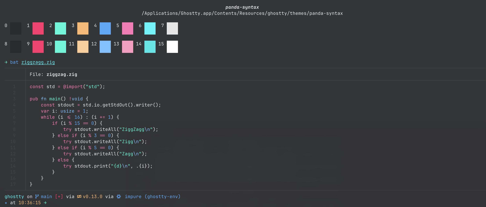

## Panda Syntax for Ghostty
A Ghostty adaptation of Siamak Mokhtari's [Panda Syntax](https://siamak.github.io/atom-panda-syntax/) theme.



## Installation

There are some options for installing this theme:

1. Themes can be placed in your Ghostty configuration directory. This is `$XDG_CONFIG_DIR/ghostty/themes` or `~/.config/ghostty/themes`, if `$XDG_CONFIG_DIR` is not set.

2. Alternatively, you can copy the file to the Ghostty resources directory - Ghostty ships with a multitude of themes that will be installed into this directory. On macOS, this list is in the `Ghostty.app/Contents/Resources/ghostty/themes` directory.

3. You can load your theme directly by editing your Ghostty configuration file, and specify the path to the theme file.

Remember to add the following line to your Ghostty configuration file:

```
theme = panda-syntax
```

or, if using method (3):

```
theme = /path/to/panda-syntax
```
Make sure to restart Ghostty to take effect!

All of these methods have the same outcome, it is simply a matter of preference. I personally prefer the first method, it keeps my additional themes separate. 

More information can be found in the [Ghostty Docs](https://ghostty.org/docs/config/reference#theme).
